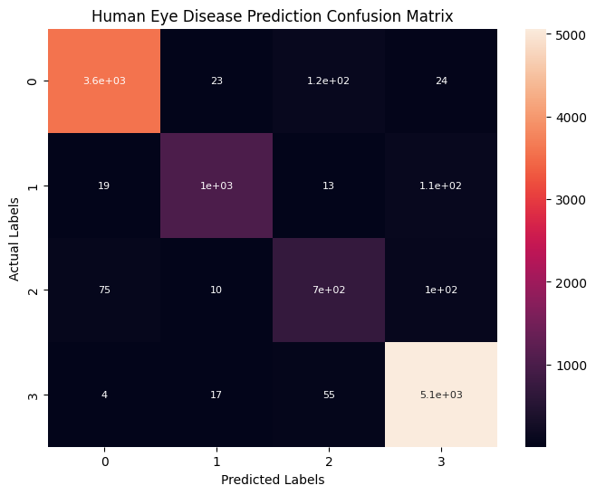
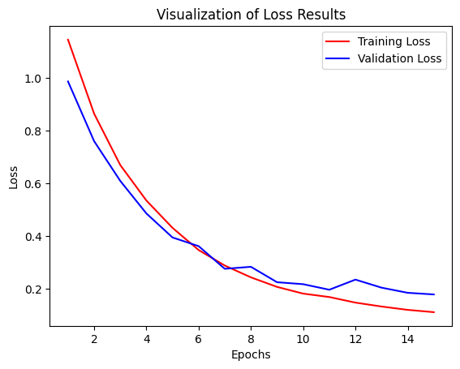

# 👁️ Optix: AI-Powered Retinal Diagnostic Suite
**Bridging the Gap Between Deep Learning and Clinical Interpretation.**

> **Note:** This repository contains the **Core Engine**. For the full Clinical Suite (including Grad-CAM XAI and RAG integration), please contact the developer via LinkedIn.

---

## 📌 Project Overview
Optix is a professional-grade medical imaging web application designed to assist ophthalmologists in detecting retinal diseases from OCT (Optical Coherence Tomography) scans. It doesn't just provide a diagnosis; it explains the "why" behind it using Clinical AI.

---

## 🧠 The Diagnostic Workflow
Optix uses a multi-layered approach to move from a raw image to a clinical recommendation:

1. **Classification:** A customized CNN architecture analyzes the OCT scan to identify one of four categories: **CNV, DME, DRUSEN,** or **NORMAL**.
2. **Explainability (XAI):** Gradient-weighted Class Activation Mapping (Grad-CAM) generates a heatmap to highlight exactly where the model detected pathology.
3. **Clinical Interpretation:** A Retrieval-Augmented Generation (RAG) system feeds clinical guidelines into **Gemini 3.1 Flash**, providing an evidence-based assistant for follow-up questions.

---
## 📊 Model Performance
The model was trained on a high-resolution OCT dataset and evaluated based on clinical precision.

| Metric | Score |
| :--- | :--- |
| **Accuracy** | 94.8% |
| **F1-Score** | 0.95 |
| **Inference Speed** | ~2.026s |

  
### 📊 Performance Visualization

> **Clinical Interpretation:** The confusion matrix demonstrates high sensitivity in identifying **DME** and **CNV** cases. The minimal overlap between classes indicates that the model has successfully learned the distinct morphological features of retinal pathologies, ensuring reliable decision support for practitioners.

---

## 🛠️ Technology Stack
Optix was built using an industry-standard stack to ensure scalability and clinical accuracy.

| Layer | Technologies |
| :--- | :--- |
| **Deep Learning** | `TensorFlow` `Keras` `OpenCV` |
| **Explainable AI** | `Grad-CAM` `Matplotlib` `NumPy` |
| **LLM & RAG** | `Google Gemini 3.1 Flash` `Clinical RAG` |
| **Frontend/UI** | `Streamlit` `HTML5/CSS3` |
| **Environment** | `Python 3.10+` `GitHub` |

---

## 🔬 Architecture & Training
The classification engine is built on a transfer learning backbone, optimized for medical feature extraction.

*   **Backbone:** `MobileNetV3Large` (Pre-trained on ImageNet for efficient feature detection).
*   **Custom Head:** Global Average Pooling followed by a `Dense` layer with `Softmax` activation for 4-class classification.
*   **Training Specs:** 
    *   **Hardware:** Trained on an `NVIDIA GTX 1660 Ti`.
    *   **Duration:** ~2 hours and 44 minutes for 15 epochs.
    *   **Optimization:** Adam optimizer with categorical cross-entropy loss.

### 📈 Training Progress

*Visualizing the convergence of training and validation loss over 15 epochs.*

---

## 📁 Dataset & Citations
The model was trained and validated using the [**Labeled Optical Coherence Tomography (OCT)**](https://www.kaggle.com/datasets/anirudhcv/labeled-optical-coherence-tomography-oct) dataset. 

### 📊 Data Distribution
To ensure robust generalization and prevent overfitting, the **109,309 high-resolution images** were partitioned using a strict split:

*   **Training Set (70%):** ~76,516 images used for weight optimization.
*   **Validation Set (20%):** ~21,862 images used for hyperparameter tuning and early stopping.
*   **Test Set (10%):** ~10,931 images reserved for final unbiased performance evaluation.

> **Primary Citation:** 
> Kermany D, Goldbaum M, Cai W et al. *Identifying Medical Diagnoses and Treatable Diseases by Image-Based Deep Learning.* **Cell.** 2018; 172(5):1122-1131. [doi:10.1016/j.cell.2018.02.010](https://doi.org/10.1016/j.cell.2018.02.010).
---

## 🛡️ CDSS & XAI Integration
Optix is designed as a **Clinical Decision Support System (CDSS)**. It does not operate as a "black box" but as a collaborative tool:

*   **XAI (Explainable AI):** Using **Grad-CAM**, the system maps the neural network's focus to the retinal layers, allowing doctors to verify the AI's logic against clinical hallmarks like subretinal fluid or drusen deposits.
*   **Clinical RAG:** By integrating a **Retrieval-Augmented Generation** pipeline, the AI assistant provides answers grounded in established medical guidelines, reducing the risk of model hallucination in a high-stakes environment.

## 🚀 Key Features
*   **Automated OCT Screening:** High-speed classification of the four primary retinal categories.
*   **Explainable Heatmaps:** Visualizes the specific regions triggering the AI's decision.
*   **Context-Aware Consultation:** A built-in clinical assistant that answers follow-up questions using validated medical guidelines.
*   **Deployment Ready:** Built with a modular architecture ready for cloud deployment.

---

## 🤝 Connect & Collaborate
I am a Data Scientist and AI Developer specializing in Healthcare & Computer Vision. I am open to job opportunities, research collaborations, and discussions regarding the future of AI in Ophthalmology.

### 📩 Request Full Access
The **Clinical Suite** (including the Grad-CAM XAI engine and the Gemini-powered RAG assistant) is available for demonstration and review by hiring managers and clinical researchers.

**[Click here to contact me on LinkedIn](https://www.linkedin.com/in/yazdan-ghanavati/)**

---

## 📜 How to Cite this Project
If you use this project's architecture or methodology, please use the following reference:

> **[Yazdan Ghanavati]. (2026). Optix: AI-Powered Retinal Diagnostic Suite.** Available at: `https://github.com/Yazdan-Ghanavati/OptixAI`

---

  
**Developed with ❤️ for the future of Retinal Health.**

